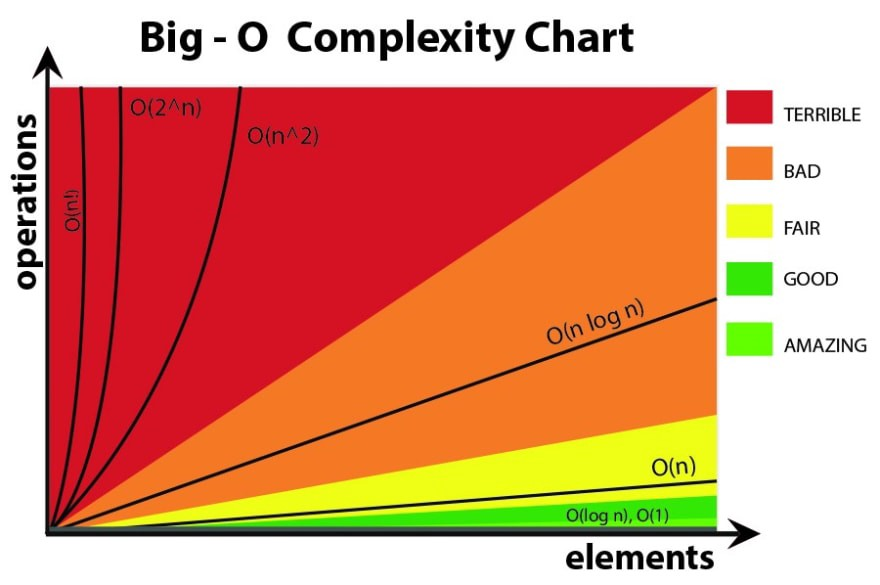

# Big O Notation

<br>

<br>
<br>

Imagine we have multiple implementation of same function.js
<br>
How can we determine which one is the best?

For Example "Write a function that accepts a string input and returns a reversed copy"

Based on [This Article: Ten ways to reverse a string in JavaScript](https://eddmann.com/posts/ten-ways-to-reverse-a-string-in-javascript/), we can implement this code with many ways.
<br>
How do we know which one is the best?

<br>

<br>

# Example 1 
Suppose we want to write a function that calculate sum of all numbers from 2 up to some number n.

### Solution1
```JavaScript
const calculateSum = (n) => {
    let sum = 0;
    for (let i = 1; i <= n; i++) {
        sum += i;
    }
    return sum
}

console.log(calculateSum(2));
console.log(calculateSum(3));
console.log(calculateSum(10));
console.log(calculateSum(500));
console.log(calculateSum(8000000000));
```

### Solution2 [Mathematic solution](https://www.wikihow.com/Find-the-Sum-of-an-Arithmetic-Sequence)
```JavaScript
const calculateSum2 = (n) => {
    return n * (n + 1) / 2;
}

console.log(calculateSum2(2));
console.log(calculateSum2(3));
console.log(calculateSum2(10));
console.log(calculateSum2(500));
console.log(calculateSum2(8000000000));
console.log(calculateSum2(9999999999999));
```

## Which one is better?
### What does better mean?
<ul>
    <li>
        Faster (How log code takes to execute)?
    </li>
    <li>
        Less Memory-intensive?
    </li>
    <li>
        More readable?
    </li>
</ul>

## The Problem with Time

<ul>
    <li>
        Different machine will record different times
    </li>
    <li>
        The same machine will record different times
    </li>
    <li>
        For fast algorithms, speed measurement may not be precise enough? 
    </li>
</ul>

[Read More](https://www.freecodecamp.org/news/big-o-notation-why-it-matters-and-why-it-doesnt-1674cfa8a23c/)


# Big O Shorthands

<ol>
    <li>
        Arithmetic operations are constant
    </li>
    <li>
        Variable assignment is constant
    </li>
    <li>
        Accessing elements in an array (by index) or Object (by key) is constant
    </li>
    <li>
        In a loop, the complexity is the length of the loop times the complexity of whatever happens inside of the loop
    </li>
</ol>

 
# Space Complexity

So far, we've been focusing in time complexity:
<br>
How can we analyze the runtime of an algorithm as the size of the inputs increases?
<br>
We can also use big O notation to analyze space complexity: 
<br>
How much additional memory do we need to allocate in order to run the code in our algorithm?

## What about the inputs?
Sometimes you'll hear the term auxiliary space complexity to refer to space required by the algorithm, not including space taken up by the inputs.

Unless otherwise noted, when we talk about space complexity, technically we'll be talking about auxiliary space complexity.

## Space Complexity in js
### Rules of Thumb

<ul>
    <li>
        Most primitives (booleans, numbers, undefined, null) are constant space O(1)
    </li>
    <li>
       String require O(n) space (where n is the string length)
    </li>
    <li>
       Reference types are generally O(n), where n is the length (for arrays) or the number of keys (for objects)
    </li>
</ul>

# Examples

```JavaScript
function sum(arr){
    let total = 0;
    for(let i = 0; i < arr.length; i++) {
        total += arr[i];
    }
    return total;
}
// O(1)
```

```JavaScript
function double(arr){
    let newArr = [];
    for(let i = 0; i < arr.length; i++) {
        newArr.push(2 * arr[i]);
    }
    return newArr;
}
// O(n)
```

