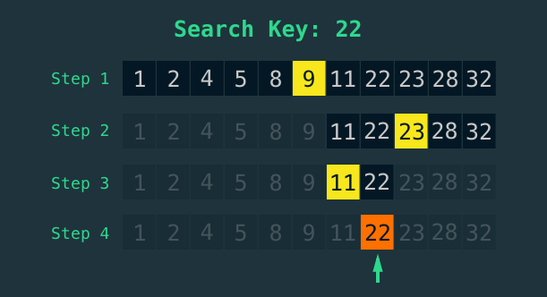

# Search

## [linear search algorithm in javascript](https://stackabuse.com/linear-search-in-javascript/)
## [Other useful link](https://www.freecodecamp.org/news/linear-search/)

O(n)

### examples isn javascript
<ul>
    <li>indexOf</li>
    <li>includes</li>
    <li>find</li>
    <li>findIndex</li>
</ul>


```javascript
function linearSearch(arr, key){
    for(let i = 0; i < arr.length; i++){
        if(arr[i] === key){
            return i
        }
    }
    return -1
}
```

## [binary search algorithm in javascript](https://stackabuse.com/binary-search-in-javascript/)

## [binary search video](https://www.youtube.com/watch?v=MFhxShGxHWc)
## [binary search video](https://www.youtube.com/watch?v=P3YID7liBug)

### Note: binary search only can be applied to sorted array
O(log n)



```javascript
function binarySearch(sortedArray, key){
    let start = 0;
    let end = sortedArray.length - 1;

    while (start <= end) {
        let middle = Math.floor((start + end) / 2);

        if (sortedArray[middle] === key) {
            // found the key
            return middle;
        } else if (sortedArray[middle] < key) {
            // continue searching to the right
            start = middle + 1;
        } else {
            // search searching to the left
            end = middle - 1;
        }
    }
	// key wasn't found
    return -1;
}
```
